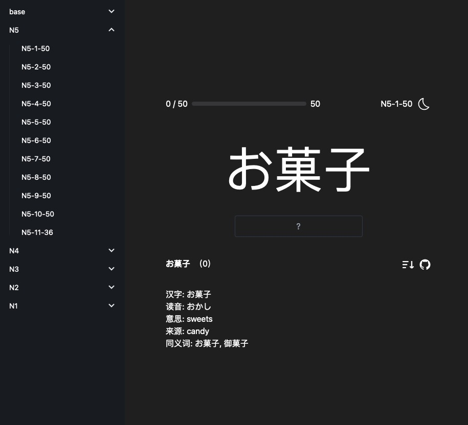

# YomiLink

[English | [中文](./README_ZH.md)]

YomiLink is an application focused on Japanese vocabulary memorization, helping users enhance their vocabulary by correctly spelling Japanese words. Learners must correctly spell each word before moving on to the next one.

## Screenshot



## Features

- **Japanese Word Spelling Practice**: Users must correctly spell Japanese words to proceed to the next one.
- **Instant Feedback**: Provides immediate feedback on whether the word was spelled correctly after the user inputs the word.
- **Gradual Progression**: Adjusts word difficulty based on learning progress, helping users continuously challenge themselves.
- **User Progress Tracking**: Records each user's learning progress and performance, allowing users to see their growth.

## Installation

Please ensure you have [Node.js](https://nodejs.org/) and [npm](https://www.npmjs.com/) installed.

1. Clone this repository to your local machine

```sh
git clone https://github.com/Raven-tu/YomiLink.git

1. Navigate to the project directory

cd yomilink

1. Install dependencies

npm install

Running

Start the application in development mode

npm start

Open your browser and go to http://localhost:3000 to view your application.

Usage

1. After starting the application, you will see an interface displaying the first Japanese word.
2. Enter the correct spelling of the word in the input box.
3. After pressing the “Submit” button, the application will validate the spelling.
4. If the spelling is correct, the application will display the next word; if the spelling is incorrect, you will be prompted to re-enter.
```
